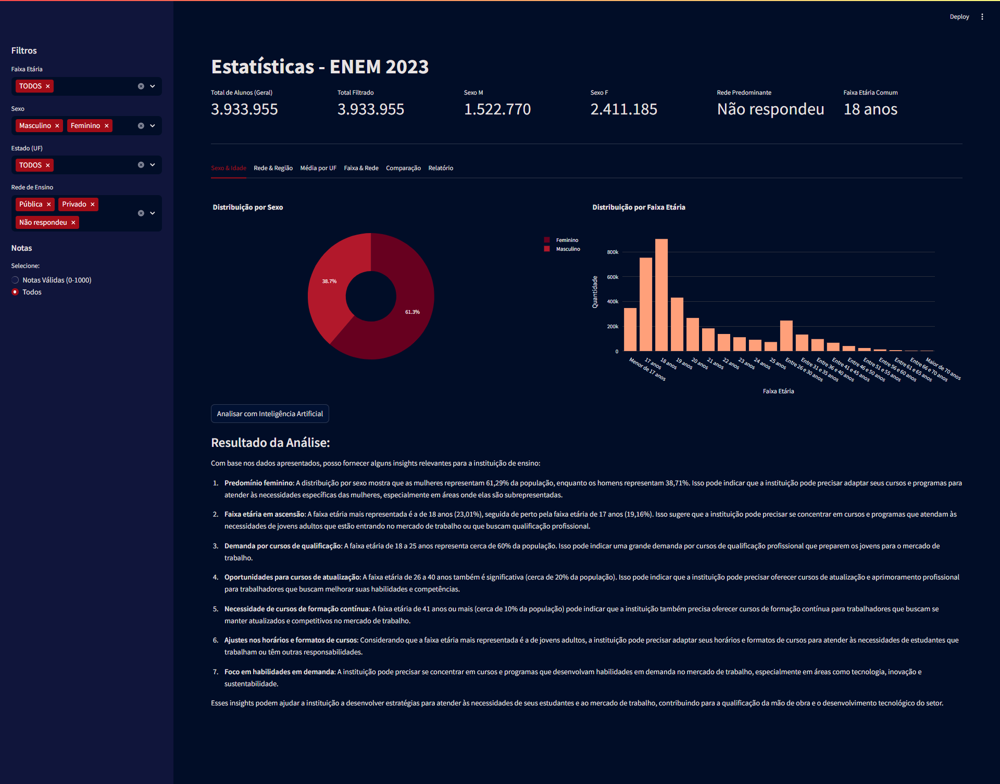
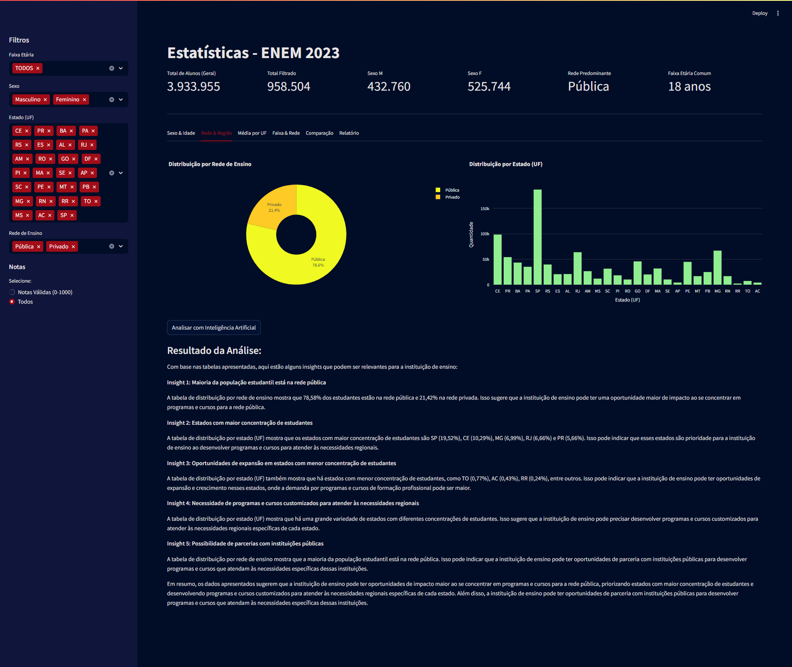
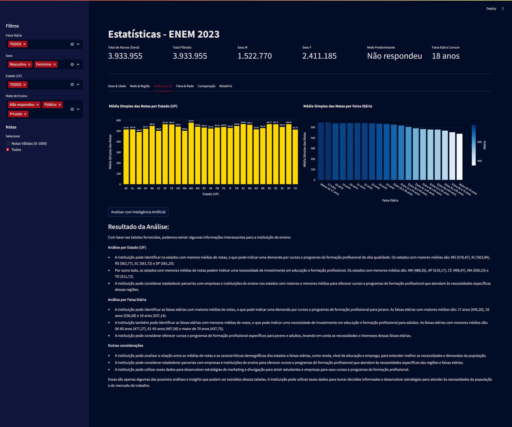
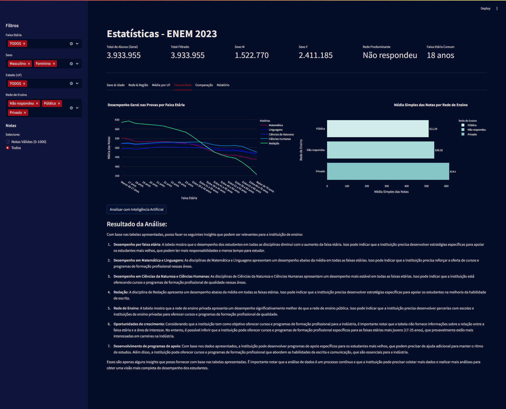
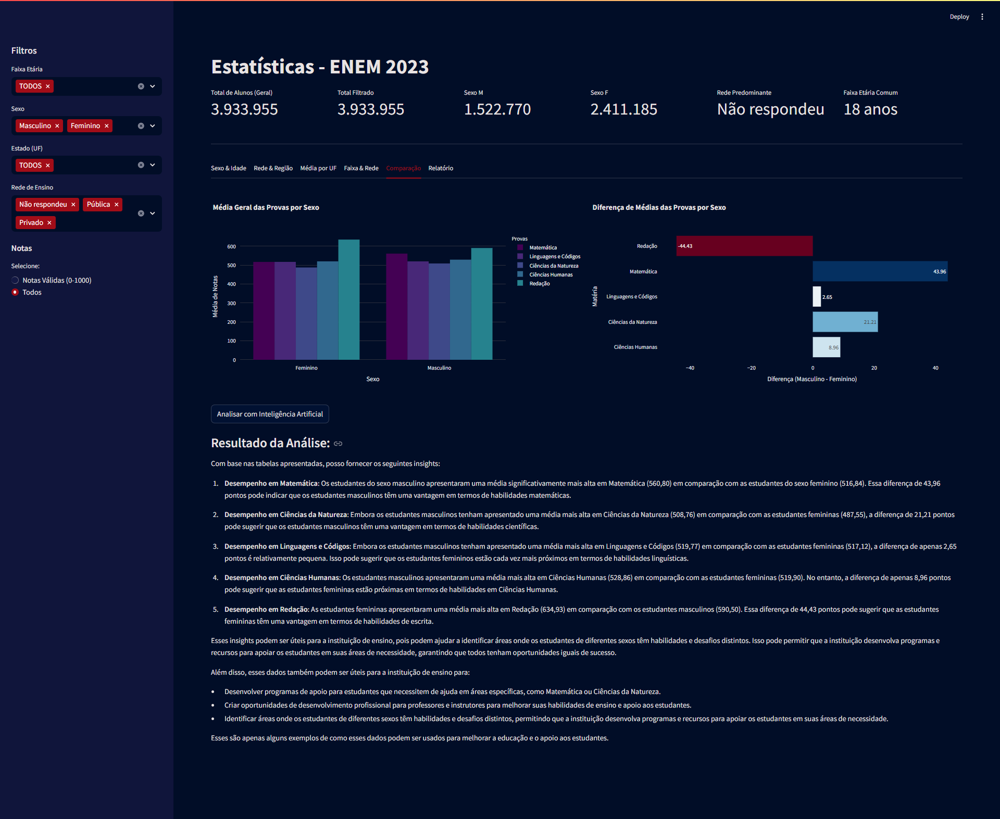
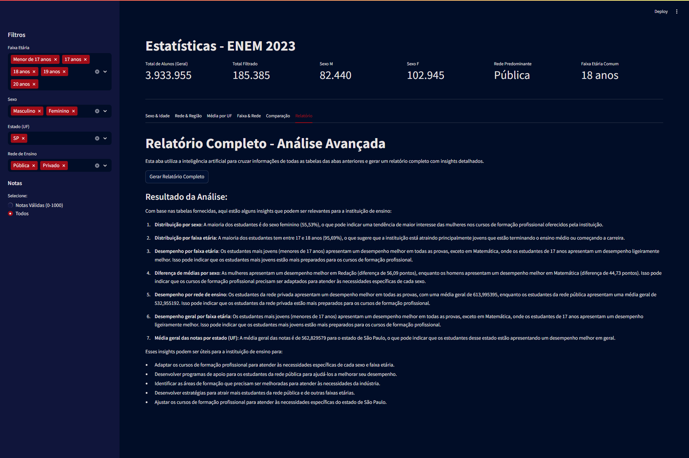

# 📊 Dashboard ENEM 2023 - Desafio 48 horas

## 🤖 Análise com Inteligência Artificial (LLM Integration)

Este dashboard utiliza uma integração direta com uma LLM da Groq (LLaMA 3 70B) para gerar insights automáticos com base nos dados carregados.

Ao clicar no botão "Analisar com Inteligência Artificial", as tabelas visíveis no dashboard são convertidas em texto e enviadas como contexto para a LLM, que retorna análises e interpretações sobre os dados.

### 📌 Características dessa integração:
- 💡 Geração de insights dinâmicos diretamente da interface do usuário.
- 📊 Interpretação contextual dos dados do ENEM 2023.
- ⚡ Rápida resposta, sem necessidade de treinar modelos ou preparar embeddings.

---

## 🚀 Funcionalidades

- Visualização interativa dos dados do ENEM 2023
- Gráficos por sexo, idade, rede de ensino, região e muito mais
- Comparativos entre estados e redes
- Relatório geral com métricas e proporções relevantes
- Assistente IA 

---

## 📸 Telas do Dashboard

### 1. Distribuição por Sexo e Faixa Etária

Exibe a proporção entre homens e mulheres, divididos por faixa etária.

---

### 2. Participantes por Rede e Região

Compara o número de participantes entre as redes pública e privada em cada região do Brasil.

---

### 3. Média por Estado (UF)

Traz a média geral de notas por estado, facilitando comparações geográficas.

---

### 4. Faixa Etária por Rede de Ensino

Mostra como diferentes faixas etárias estão distribuídas entre escolas públicas e privadas.

---

### 5. Comparativo de Médias entre Redes

Comparação direta entre as médias das redes pública e privada em cada estado.

---

### 6. Relatório Geral com Métricas

Resumo completo com principais KPIs, como total de participantes, proporção por rede, sexo predominante e mais.

---

## ⚙️ Instalação e Execução

```bash
# Clone o repositório
git clone https://github.com/seu-usuario/dashboard-enem-2023.git
cd dashboard-enem-2023

# Crie um ambiente virtual
python -m venv venv
source venv/bin/activate  # Linux/Mac
venv\Scripts\activate   # Windows

# Instale as dependências
pip install -r requirements.txt

# Execute o app
streamlit run app.py
```

---

## 📦 Estrutura do Projeto

```bash
📦dashboard_enem_2023_LLM
├── src/
│ └── assets/
│ ├── 1_sexo_idadea.png
│ ├── 2_rede_regiao.png
│ ├── 3_media_uf.png
│ ├── 4_faixa_rede.png
│ ├── 5_comparacao.png
│ └── 6_relatorio_geral.png
├── .gitignore
├── LICENSE
├── README.md
├── app.py
├── chatbot.py
├── constants.py
├── dashboard.py
├── data_loader.py
├── requirements.txt
└── sidebar.py
```
---

## 📊 Performance

Este projeto também demonstrou a importância da etapa de **tratamento e otimização de dados**:

- Apenas as colunas necessárias foram selecionadas.
- O CSV original foi convertido para Parquet com compressão máxima.
- Resultado: Redução de 1.7GB para ~37MB, com alta performance de carregamento.

---
## 🧠 Conclusão

Este projeto demonstra como é possível unir visualização de dados com inteligência artificial para oferecer um produto interativo, rápido e intuitivo. O Streamlit se mostrou excelente para protótipos, e a integração com RAG abre portas para novas formas de análise.

---
## 👨‍💻 Autor

**Mewerton de Melo Silva**  
Desenvolvedor e Especialista em IA aplicada à análise de dados.  
[LinkedIn](https://www.linkedin.com/in/mewerton)

---
## 📢 Compartilhe

Se este projeto te inspirou, compartilhe no LinkedIn com a hashtag:  
`#ENEM2023` `#Dashboard` `#Python` `#Streamlit` `#InteligenciaArtificial` `#DataScience` `#OpenSource` `#AnáliseDeDados` `#Portfolio` `#Projeto48Horas`
